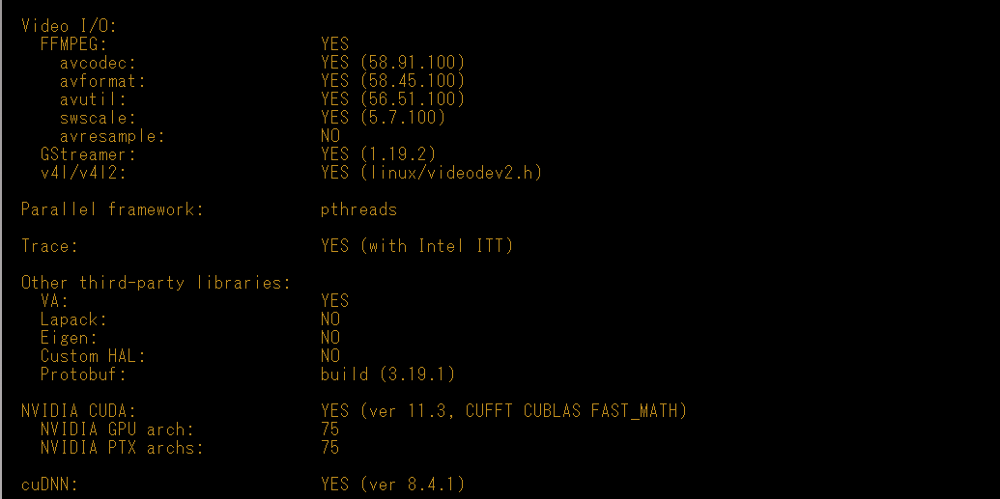
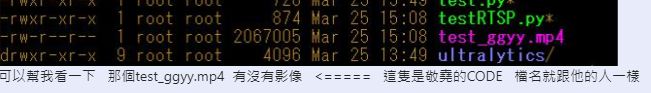
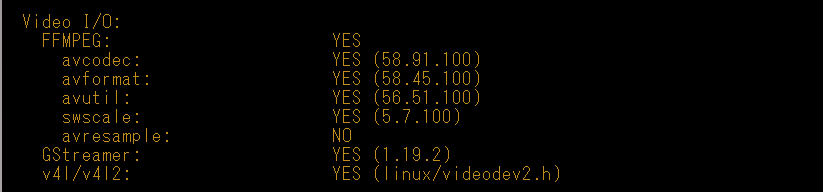

# docker

```jsx

cudnn
https://koding.work/how-to-install-cuda-and-cudnn-to-ubuntu-20-04/

##  路徑  裝到 /home
cd /workdir
cp * /home
cd /home

# 解壓檔案，需替換成你下載的檔名
tar -xvf cudnn-linux-x86_64-8.4.1.50_cuda11.6-archive.tar.xz
mv cudnn-linux-x86_64-8.4.1.50_cuda11.6-archive cuda

# 將解壓的檔案搬到對應資料夾下就完成！
cp cuda/include/cudnn*.h /usr/local/cuda/include 
cp -P cuda/lib/libcudnn* /usr/local/cuda/lib64 
chmod a+r /usr/local/cuda/include/cudnn*.h /usr/local/cuda/lib64/libcudnn*

2. apt-get update
3. apt-get install -y --no-install-recommends --fix-missing \
autoconf \
automake \
build-essential \
cmake \
git-core \
libass-dev \
libfreetype6-dev \
libgnutls28-dev \
libmp3lame-dev \
libsdl2-dev \
libtool \
libva-dev \
libvdpau-dev \
libvorbis-dev \
libxcb1-dev \
libxcb-shm0-dev \
libxcb-xfixes0-dev \
meson \
ninja-build \
pkg-config \
texinfo \
wget \
yasm \
zlib1g-dev \
libbz2-dev \
liblzma-dev \
git \
vim \
unzip \
nasm

4. apt-get install -y --no-install-recommends --fix-missing \
ninja-build \
build-essential \
dpkg-dev \
flex \
bison \
autotools-dev \
automake \
liborc-dev \
autopoint \
libtool \
gtk-doc-tools \
python3-pip \
valgrind \
libgirepository1.0-dev \
libcap-dev \
libgtk-3-dev \
libunwind-dev \
clzip \
gobject-introspection \
libdw-dev \
libxv-dev \
libasound2-dev \
libtheora-dev \
libogg-dev \
libvorbis-dev \
libbz2-dev \
libv4l-dev \
libvpx-dev \
libjack-jackd2-dev \
libsoup2.4-dev \
libpulse-dev \
faad \
libfaad-dev \
libfaac-dev \
libx264-dev \
libmad0-dev \
yasm

5.
#pip3 uninstall opencv-python
python3 -m pip install meson==0.60.0
#pip3 install requests

cd /home
6. ffmpeg 4.3.4
tar xvzf ffmpeg.tgz && cd ffmpeg/ &&  ./configure --enable-shared --prefix=/usr/local/ffmpeg && make &&  make install 
#Gstreamer
cd /home
tar xvf gmp-6.2.1.tar.lz && cd gmp-6.2.1/ &&  ./configure && make &&  make install 
cd /home
tar xvf gsl-latest.tar.gz && cd gsl-2.7.1/ &&  ./configure && make &&  make install
cd /home
tar xvf gstreamer-1.19.2.tar.xz && cd gstreamer-1.19.2/ &&  meson build  && ninja -C build  &&  ninja -C build install
cd /home
tar xvf gst-plugins-base-1.19.2.tar.xz && cd gst-plugins-base-1.19.2/ &&  meson build  && ninja -C build  &&  ninja -C build install
cd /home
tar xvf gst-plugins-good-1.19.2.tar.xz && cd gst-plugins-good-1.19.2/ &&  meson build  && ninja -C build  &&  ninja -C build install
cd /home
tar xvf gst-plugins-bad-1.19.2.tar.xz && cd gst-plugins-bad-1.19.2/ &&  meson build  && ninja -C build  &&  ninja -C build install
cd /home
tar xvf gst-plugins-ugly-1.19.2.tar.xz && cd gst-plugins-ugly-1.19.2/ &&  meson build  && ninja -C build  &&  ninja -C build install
cd /home
export PKG_CONFIG_PATH=$(pwd)/ffmpeg/libavfilter:$(pwd)/ffmpeg/libavdevice:$(pwd)/ffmpeg/libswscale:$(pwd)/ffmpeg/libavutil:$(pwd)/ffmpeg/libavformat:$(pwd)/ffmpeg/libavcodec:$(pwd)/ffmpeg/libswresample && tar xvf gst-libav-1.19.2.tar.xz && cd gst-libav-1.19.2/ &&  meson build  && ninja -C build  &&  ninja -C build install
cd /home

7. opencv 4.6

export CPLUS_INCLUDE_PATH=/usr/lib/python3.8/config-3.8-x86_64-linux-gnu
tar xvzf opencv.tgz && cd opencv/opencv-4.x/ && mkdir build && cd build

cmake -D CMAKE_BUILD_TYPE=RELEASE \
-D CMAKE_INSTALL_PREFIX=/usr/local \
-D INSTALL_PYTHON_EXAMPLES=ON \
-D INSTALL_C_EXAMPLES=OFF \
-D BUILD_DOCS=OFF \
-D BUILD_PERF_TESTS=OFF \
-D BUILD_TESTS=OFF \
-D BUILD_PACKAGE=OFF \
-D BUILD_EXAMPLES=OFF \
-D WITH_TBB=ON \
-D ENABLE_FAST_MATH=1 \
-D CUDA_FAST_MATH=1 \
-D CUDA_TOOLKIT_ROOT_DIR=/usr/local/cuda \
-D WITH_CUDA=ON \
-D WITH_CUBLAS=ON \
-D WITH_CUFFT=ON \
-D WITH_NVCUVID=ON \
-D WITH_IPP=OFF \
-D WITH_V4L=ON \
-D WITH_1394=OFF \
-D WITH_GTK=ON \
-D WITH_QT=OFF \
-D WITH_OPENGL=OFF \
-D WITH_EIGEN=ON \
-D WITH_FFMPEG=ON \
-D WITH_GSTREAMER=ON \
-D BUILD_JAVA=OFF \
-D BUILD_opencv_python3=ON \
-D BUILD_opencv_python2=OFF \
-D BUILD_NEW_PYTHON_SUPPORT=ON \
-D OPENCV_SKIP_PYTHON_LOADER=ON \
-D OPENCV_GENERATE_PKGCONFIG=ON \
-D OPENCV_ENABLE_NONFREE=ON \
-D OPENCV_EXTRA_MODULES_PATH=/home/opencv/opencv_contrib-4.x/modules \
-D WITH_CUDNN=ON \
-D OPENCV_DNN_CUDA=ON \
-D CUDA_ARCH_BIN=7.5 \
-D CUDA_ARCH_PTX=7.5 \
-D CUDNN_LIBRARY=/usr/local/cuda/lib64/libcudnn.so \
-D PYTHON3_INCLUDE_DIR=/usr/include/python3.8 \
-D PYTHON3_NUMPY_INCLUDE_DIRS=/usr/lib/python3/dist-packages/numpy/core/include \
-D PYTHON3_PACKAGES_PATH=/usr/lib/python3/dist-packages \
-D PYTHON3_LIBRARY=/usr/lib/python3.8/config-3.8-x86_64-linux-gnu \
-D PYTHON_EXECUTABLE:FILEPATH=/usr/bin/python3 \
-D PYTHON3_EXECUTABLE=/usr/bin/python3 \
-D PYTHON_EXECUTABLE=/usr/bin/python3 \
-D CUDNN_INCLUDE_DIR=/usr/local/cuda/include ..

### fix Python.h
apt install libpython3-dev
apt install python3-dev

###fix numpy
pip3 install numpy
ln -s /usr/local/lib/python3.8/dist-packages/numpy/core/include/numpy /usr/include/numpy

## load ffmpeg
vim /etc/ld.so.conf
插入一行==>/usr/local/ffmpeg/lib/
ldconfig

make -j$(nproc)
make install

>>> import cv2
>>> printf(cv2.getBuildInformation())
check if 
GStreamer = YES
v4l =  YES
ffmpeg is YES
CUDA = YES
CUDNN = YES
```




## 測試

```jsx
cd /workdir
python3 testRTSP.py
```


